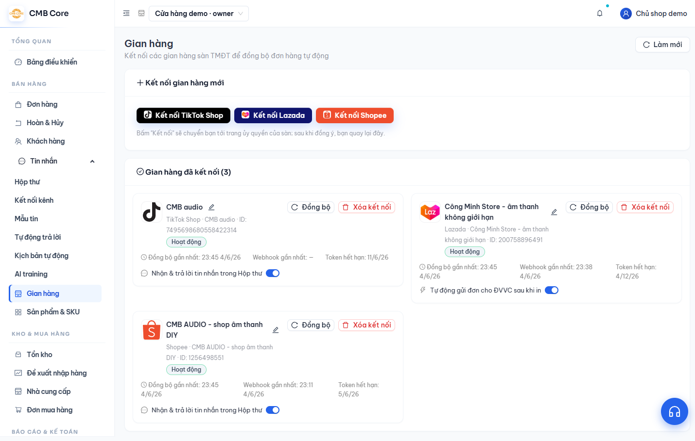

# Gian hàng (kết nối sàn)

**Việc này giúp gì:** Kết nối shop của bạn trên các sàn (TikTok Shop, Lazada) để đơn hàng và sản phẩm tự động đổ về phần mềm, không phải nhập tay.

**Bạn cần:** Vai trò **Chủ sở hữu** hoặc **Quản trị** để kết nối/ngắt gian hàng.

## Các bước

1. Vào menu **Gian hàng** (nhóm **Bán hàng**).

   

2. Ở khu **Kết nối gian hàng mới**, bấm nút **Kết nối TikTok** hoặc **Kết nối Lazada** tương ứng với sàn của bạn.

3. Một cửa sổ của sàn hiện ra để bạn đăng nhập và **đồng ý cấp quyền**. Làm theo hướng dẫn trên cửa sổ đó.

4. Sau khi đồng ý, cửa sổ tự đóng và quay lại trang **Gian hàng**. Shop vừa kết nối sẽ xuất hiện trong mục **Gian hàng đã kết nối**.

5. Lần đầu kết nối, hệ thống tự tải về đơn hàng của khoảng **90 ngày gần nhất**. Bạn chờ một lát để dữ liệu về.

6. Khi cần lấy dữ liệu mới nhất, bấm **Đồng bộ** trên thẻ gian hàng (hoặc nút **Làm mới** ở góc trên).

## Mẹo

- Mỗi thẻ gian hàng có nhãn trạng thái: **Hoạt động** (đang chạy tốt), **Token hết hạn** (cần bấm **Cấp quyền lại**), **Đã ngắt kết nối**, **Tạm dừng**.
- Đồng bộ chạy lại nhiều lần vẫn an toàn: đơn đã có chỉ được cập nhật trạng thái, không bị tạo trùng.
- **Shopee** hiện đang chờ duyệt kết nối nên nút có thể chưa bấm được.

## Lỗi thường gặp & cách xử lý

- **Thấy "Token hết hạn":** Bấm **Cấp quyền lại** trên thẻ gian hàng và đăng nhập lại sàn.
- **Lazada báo chặn vì IP:** Sàn yêu cầu thêm địa chỉ máy chủ vào danh sách cho phép. Màn hình sẽ hiện địa chỉ cần thêm; nếu chưa rõ, hãy hỏi qua **Trợ giúp → Hỏi CSKH**.
- **"Gian hàng này đã được kết nối ở nơi khác":** Shop đó đang gắn với một tài khoản/gian hàng khác. Hãy ngắt ở nơi cũ trước, hoặc liên hệ CSKH.
- **Lỡ ngắt kết nối rồi muốn nối lại:** Cứ kết nối lại bình thường — hệ thống tự khôi phục liên kết cũ, không tạo trùng.

> Lưu ý: **Xóa kết nối** sẽ xoá đơn và các liên kết SKU của gian hàng đó (và nhả phần tồn đang giữ). Chỉ xoá khi chắc chắn.

## Xem thêm

- [Sản phẩm & SKU](07-san-pham-sku.md)
- [Đơn hàng & giao hàng](04-don-hang.md)
- [Nhật ký đồng bộ](16-nhat-ky-dong-bo.md)
