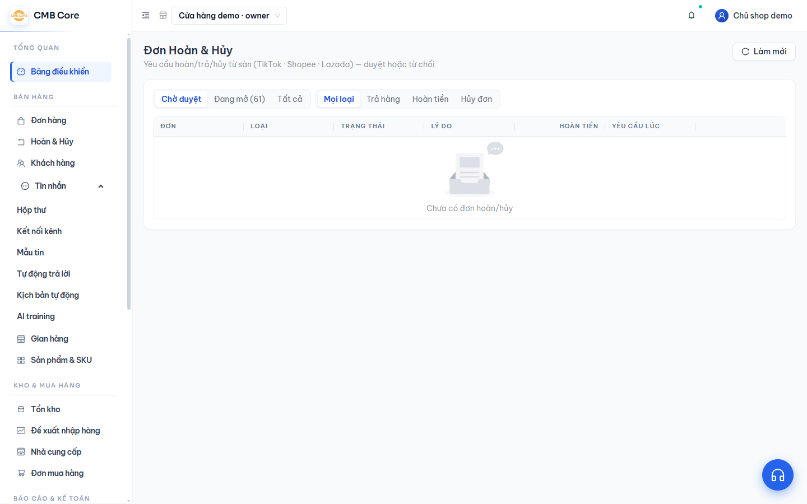

# Hoàn & Hủy

**Việc này giúp gì:** Xem và xử lý các yêu cầu **hoàn tiền / trả hàng / hủy đơn** mà khách gửi từ sàn (TikTok, Shopee, Lazada), duyệt hoặc từ chối ngay trong phần mềm.

## Các bước

1. Vào menu **Hoàn & Hủy** (nhóm **Bán hàng**).

   

2. Dùng hai bộ lọc ở trên để xem nhanh:
   - Theo tiến độ: **Chờ duyệt** / **Đang mở** / **Tất cả**.
   - Theo loại: **Hủy đơn** / **Trả hàng** / **Hoàn tiền** (hoặc tất cả).

3. Xem bảng yêu cầu với các cột: **Đơn**, **Loại**, **Trạng thái**, **Lý do**, **Hoàn tiền**, **Yêu cầu lúc**.

4. Với yêu cầu đang **Chờ xử lý**, bấm **Duyệt** để chấp nhận hoặc **Từ chối** nếu không đồng ý.

5. Bấm **Làm mới** để cập nhật yêu cầu mới nhất từ sàn.

## Mẹo

- Sau khi bạn duyệt, hệ thống và sàn sẽ tự chuyển tiếp các bước (đang xử lý → hoàn tất) khi sàn xác nhận.
- Ảnh hưởng tới tồn kho: nếu **hủy trước khi giao**, phần tồn đang giữ sẽ được nhả lại; nếu **hoàn sau khi giao và hàng đã về**, tồn sẽ được cộng lại.

## Lỗi thường gặp & cách xử lý

- **Chưa thấy yêu cầu nào:** Bình thường nếu hiện chưa có khách yêu cầu hoàn/hủy. Yêu cầu sẽ tự xuất hiện khi khách gửi trên sàn.
- **Duyệt/từ chối không được:** Yêu cầu có thể đã được sàn xử lý hoặc đổi trạng thái. Bấm **Làm mới** rồi thử lại.

## Xem thêm

- [Đơn hàng & giao hàng](04-don-hang.md)
- [Tồn kho](08-ton-kho.md)
- [Đối soát & lợi nhuận](12-doi-soat-loi-nhuan.md)
