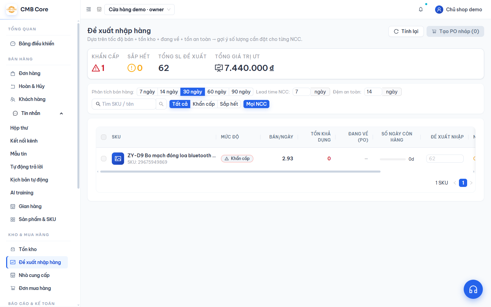
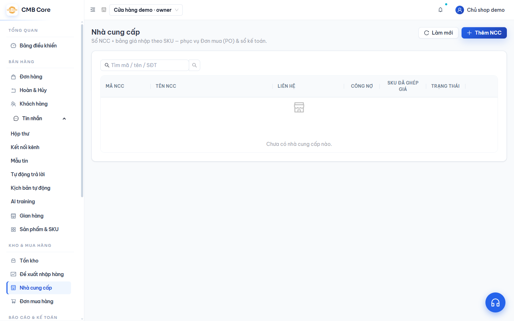
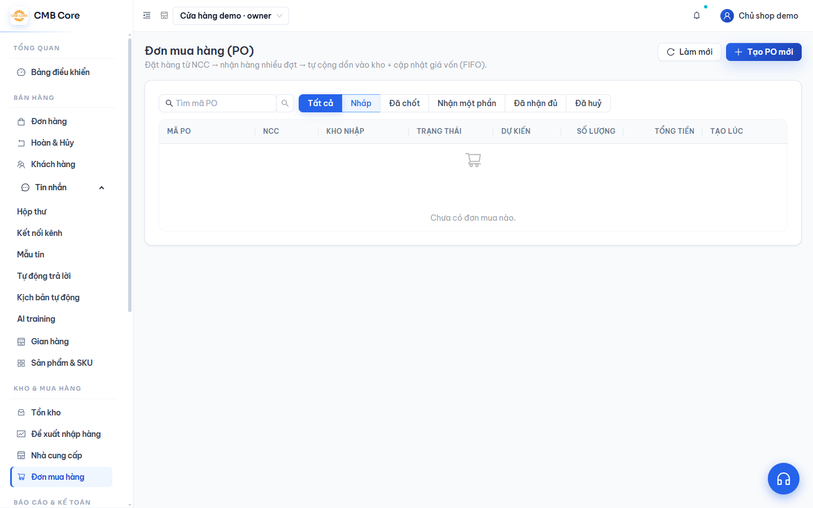

# Mua hàng

**Việc này giúp gì:** Giúp bạn biết nên nhập món gì, đặt mua từ nhà cung cấp và nhận hàng vào kho. Khi nhận hàng, hệ thống tự cộng tồn, ghi giá vốn và lên sổ kế toán.

**Bạn cần:** Gói **Pro** trở lên; vai trò **NV kho**, **Quản trị** hoặc **Chủ sở hữu**.

## Đề xuất nhập hàng

1. Vào menu **Đề xuất nhập hàng**.

   

2. Hệ thống tự gợi ý số cần đặt dựa trên tốc độ bán + tồn khả dụng + hàng đang về. Mỗi mã được xếp mức: **Khẩn cấp**, **Sắp hết**, hoặc đủ hàng.
3. Bấm **Tính lại** nếu muốn cập nhật theo số mới nhất.
4. Tích chọn các mã cần mua → bấm **Tạo PO nháp** (hệ thống tự gom theo nhà cung cấp).

## Nhà cung cấp

1. Vào menu **Nhà cung cấp**.

   

2. Bấm **Thêm NCC**, nhập Tên, số điện thoại, email, mã số thuế, địa chỉ, điều khoản công nợ.
3. Trong phần chỉnh sửa nhà cung cấp, bạn có thể đặt **bảng giá nhập** theo từng mã hàng (giá, số lượng tối thiểu).

## Đơn mua hàng & nhận hàng

1. Vào menu **Đơn mua hàng**.

   

2. Bấm tạo đơn mua: chọn **Nhà cung cấp**, **Kho nhập**, thêm các dòng (mã hàng, số lượng đặt, giá nhập) → lưu **nháp**.
3. Khi chốt giá, bấm **Chốt PO** (sau khi chốt không sửa được nữa).
4. Khi hàng về, bấm **Nhận hàng** → nhập số lượng nhận → tạo phiếu nhập → **xác nhận**.

> Khi xác nhận nhận hàng: tồn được **cộng thêm**, một **lớp giá vốn** mới được tạo, và hệ thống **tự lên sổ kế toán**.

## Mẹo

- Đơn mua có các trạng thái: Nháp → Đã chốt → Nhận một phần → Nhận đủ (hoặc Đã huỷ).
- Chỉ huỷ được đơn mua khi còn ở **nháp**.

## Lỗi thường gặp & cách xử lý

- **"Nhận vượt số còn lại":** Bạn nhập số nhận lớn hơn số còn thiếu của đơn. Nhập đúng số còn lại.
- **Không sửa được đơn mua:** Đơn đã **Chốt PO** nên khoá. Tạo phiếu điều chỉnh khác nếu cần.
- **Không xoá được nhà cung cấp:** Nhà cung cấp còn đơn mua chưa đóng. Đóng/huỷ các đơn đó trước.

## Xem thêm

- [Tồn kho](08-ton-kho.md)
- [Kế toán (TT133)](14-ke-toan.md)
