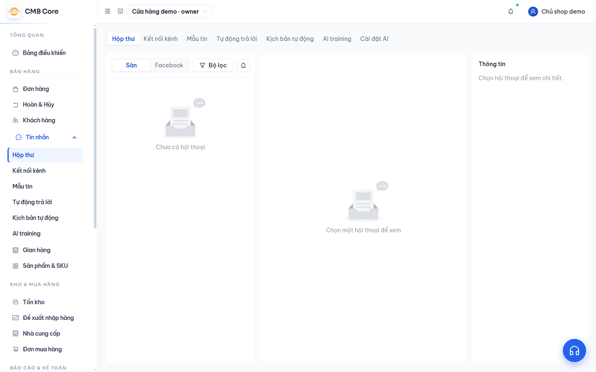
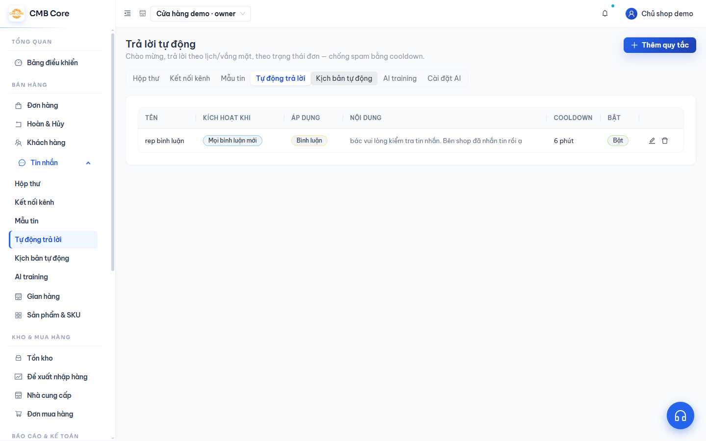

# Tin nhắn

**Việc này giúp gì:** Gom tin nhắn và bình luận từ Facebook và các sàn (TikTok, Shopee, Lazada) về **một hộp thư**, trả lời nhanh bằng mẫu tin, và có thể để AI hỗ trợ trả lời.

Menu **Tin nhắn** có các mục: **Hộp thư**, **Kết nối kênh**, **Mẫu tin**, **Tự động trả lời**, **Kịch bản tự động**, **AI training**.

## Hộp thư

1. Vào **Tin nhắn → Hộp thư**.

   

2. Chọn tab **Sàn** hoặc **Facebook** để xem theo nguồn. Với Facebook còn có tab phụ: Tất cả / Tin nhắn / Bình luận.
3. Bấm vào một hội thoại để xem và trả lời. Khi soạn, bạn có thể đính kèm ảnh/video, **chèn mẫu tin** (gõ dấu `/` + phím tắt) và chèn emoji.
4. Với **bình luận** Facebook, mỗi bình luận có nút **Thích**, **Nhắn riêng** và **Xoá**.

## Kết nối kênh

- Vào **Tin nhắn → Kết nối kênh** để bấm **Kết nối Facebook Page** (chọn trang) và **Kết nối Lazada IM** (chat Lazada). Chat TikTok dùng chung kết nối ở menu [Gian hàng](03-gian-hang.md).

## Mẫu tin

- Vào **Tin nhắn → Mẫu tin** để tạo câu trả lời sẵn. Mỗi mẫu có **phím tắt** và có thể chèn biến như tên khách, mã đơn, trạng thái đơn… để tự điền.

## Tự động trả lời

1. Vào **Tin nhắn → Tự động trả lời**.

   

2. Tạo quy tắc theo một trong các kiểu: **Tin đầu tiên**, **Theo lịch** (giờ vắng mặt), **Theo trạng thái đơn**, **Chưa trả lời sau N phút**, **Từ khoá**, hoặc **Mọi bình luận**.
3. Chọn áp cho tin nhắn, bình luận, hoặc cả hai; chọn nội dung (văn bản, mẫu tin, hoặc để AI tự soạn).
4. Đặt **thời gian chờ** (chống gửi lặp) và bật quy tắc.

## Kịch bản tự động (gói Business)

- Vào **Tin nhắn → Kịch bản tự động** để dựng luồng tự động bằng cách kéo–thả các bước. Phù hợp với kịch bản phức tạp hơn quy tắc đơn giản.

## AI training & trả lời bằng AI

- Vào **Tin nhắn → AI training** để dạy AI bằng tài liệu của bạn (gõ tay, dán liên kết Google Sheets, hoặc tải file PDF/Word/Excel). Tài liệu chuyển sang **Sẵn sàng** là dùng được.
- Trong **Cài đặt** (mục AI tin nhắn), bạn bật **AI gợi ý** (nhân viên duyệt rồi gửi) hoặc **AI tự động trả lời** (gửi luôn). Cả hai cần gói **Business**.
- An toàn: các tin nhạy cảm (khiếu nại, hoàn tiền, gấp, pháp lý, lời lẽ thô tục) sẽ **chuyển cho nhân viên**, AI không tự gửi.

## Quy tắc Facebook cần nhớ

- Chỉ nhắn tự do trong **24 giờ** kể từ tin cuối của khách; quá hạn cần dùng **thẻ tin nhắn** (ô soạn tự gắn giúp bạn).
- **Nhắn riêng** một bình luận chỉ được **1 lần/bình luận** — báo "đã nhắn rồi" là bình thường.
- Nút **Thích** bình luận cần Trang đã được cấp quyền tương tác.

## Lỗi thường gặp & cách xử lý

- **Lazada không có tin nhắn nào:** App chat Lazada chưa được cấp quyền nhóm tin nhắn trên sàn. Hãy hỏi **Trợ giúp → Hỏi CSKH** để được hướng dẫn cấp quyền.
- **Facebook báo "cần cấp quyền" ở bình luận:** Vào **Kết nối kênh**, kết nối lại trang và đồng ý đủ quyền.
- **"Ngoài cửa sổ 24h":** Khách cần nhắn lại trước thì bạn mới gửi tự do được.

## Xem thêm

- [Khách hàng](06-khach-hang.md)
- [Cài đặt](17-cai-dat.md)
